# Simulação de Redes 5G

Alunos:

- Renan Krzesinski
- Ygor Sad Machado

Ferramentas:

- [Simu5G PnP](http://simu5g.org/simu5g-pnp.html)
- [VirtualBox](https://www.virtualbox.org/)

### Vídeo

https://drive.google.com/file/d/15XzWEzhu-VcAUY-daDXiMR28jI1ooL7t/view?usp=sharing

## Ambientes utilizados

### Debian
Configurações:
- Processador: Intel Core i5 @ 3,0GHz
- Memória: 16 GB
- GPU: -
- Sistema Operacional: Debian 11

### OS X
Configurações:
- Processador: Intel Core i7 @ 3,6GHz
- Memória: 16 GB
- GPU: Radeon Pro 555 2 GB
- Sistema Operacional: macOS 10.14.6

## Instalação

A ferramenta de simulação que vamos usar é distribuída na forma de uma imagem de máquina virtual no formato [OVA](https://en.wikipedia.org/wiki/Open_Virtualization_Format). Para abri-la, precisamos de um virtualizador com suporte a esse formato. Aqui optamos por usar o VirtualBox pela simplicidade de instalação e configuração.

[... Eventualmente colocar install do virtualbox ...]

Com o VirtualBox instalado, acessamos o site da [ferramenta de simulação](http://simu5g.org/simu5g-pnp.html). Nele, existem duas versões do simulador – uma básica e uma com suporte a redes veiculares; usaremos aqui a primeira versão.

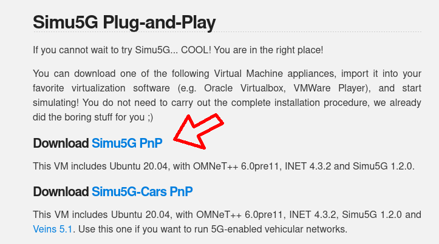 

Para baixá-la, clique em "Download Simu5G PnP". Esse link leva a uma página de download para o arquivo OVA. Basta clicar em "Download" e esperar a transferência concluir.

> ⚠️ Note que a transferência pode demorar pois o arquivo é grande (cerca de 8.5 GB)

## Configuração

Terminado o download do OVA, é preciso importá-lo. Para isso, abra o VirtualBox, vá em `File > Import Appliance`.

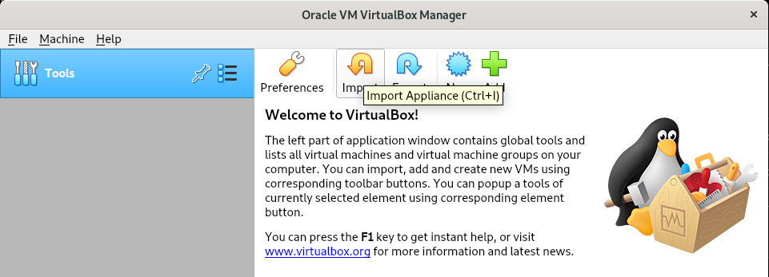 

Na janela que surgir, no campo "File", selecione o arquivo baixado na etapa anterior.

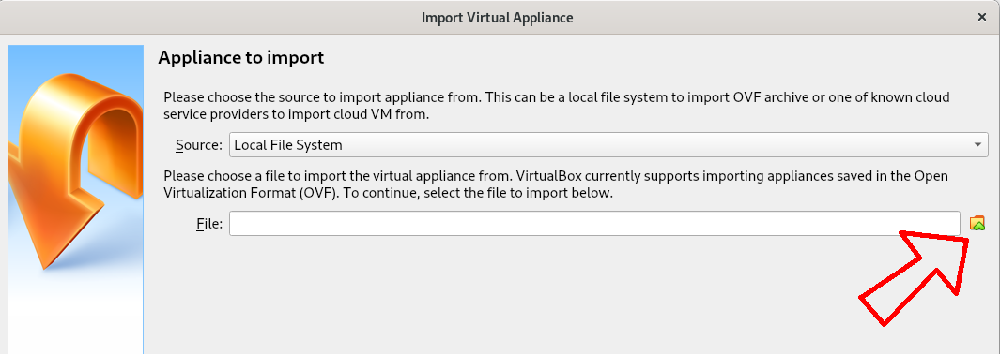 

A tela seguinte mostra as configurações  padrão da máquina virtual sendo importada. Não é preciso fazer quaisquer modificações. Após clicar em "Import", aguarde a conclusão do processo. Isso pode levar alguns minutos.

## Simulação

Uma vez com a máquina virtual importada, inicie-a clicando em "Start" na janela principal do VirtualBox.

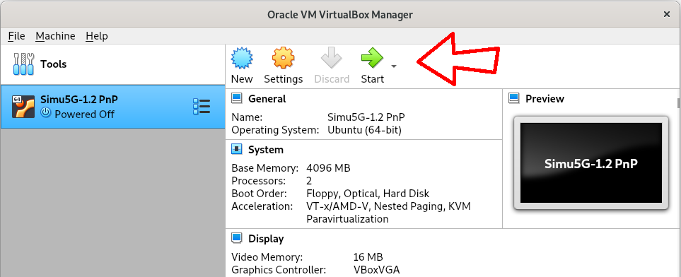 

Dentro da máquina virtual, abra o simulador clicando em "OMNeT++ IDE" na barra lateral da área de trabalho.

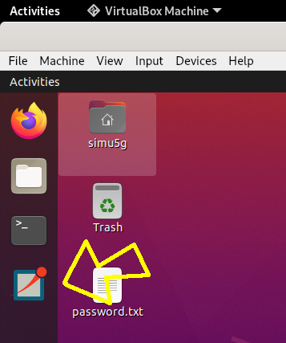 

Na primeira execução, aparece uma janela de configuração do workspace. Você pode deixar com os valores padrões, e opcionalmente marcar a caixa "Use this as the default and do not ask again" para que essa janela não apareça novamente.

Após clicar em "Launch", a janela principal do "OMNeT++ IDE" estará aberta. Para ver a lista de simulações de redes 5G disponíveis, no menu "Project Explorer" abra as pastas `simu5G > simulations > NR`. Cada subpasta dentro desse diretório equivale a uma simulação distinta.

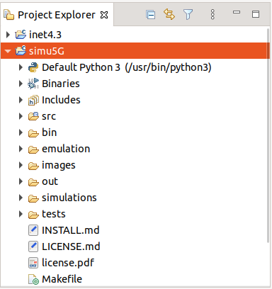

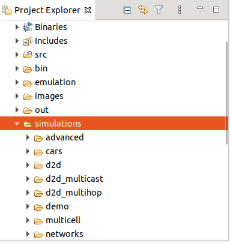

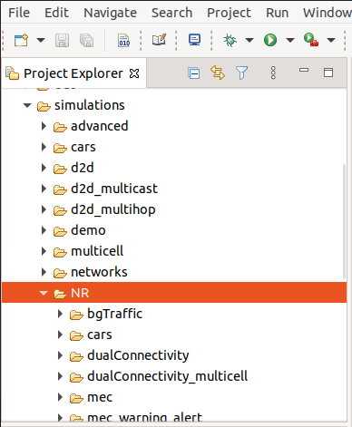

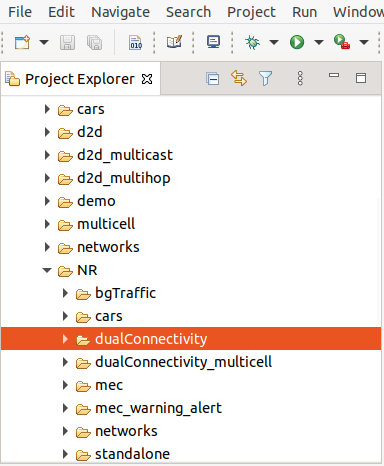

 

> ⚠️ A documentação do Simu5G não é muito clara acerca do objetivo de cada uma dessas simulações. Tentamos rodar as simulações `bgTraffic` e `cars`, mas sem sucesso. 
> Apesar de a máquina virtual ter sido disponibilizada pela própria equipe do Simu5G, e de não termos feito quaisquer alterações nela, essas simulações não parecem funcionar adequadamente.

Escolhemos a simulação `dualConnectivity`. Para executá-la, na árvore de diretórios, clique em cima da pasta correspondente a ela, e em seguida no ícone de "Run" na barra de ferramentas.

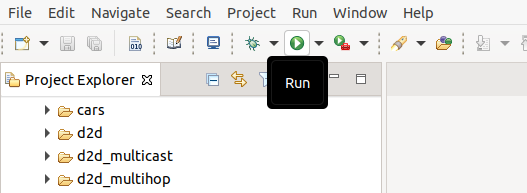 

O simulador fará o carregamento dos arquivos e, quando estiver pronto, abrirá uma janela em que é possível selecionar uma dentre as configurações disponíveis. Deixe como está e clique em "OK."

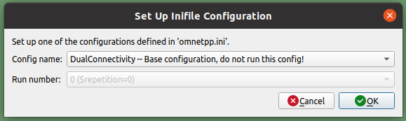 

> ⚠️ Apesar de a maior parte das configurações vir acompanhada de "do not run this config", isso não parece afetar a simulação.

A tela que abre em seguida mostra diversas informações da simulação: um mapa apresentando a topologia da rede simulada, uma linha do tempo, os logs de saída da simulação, etc.

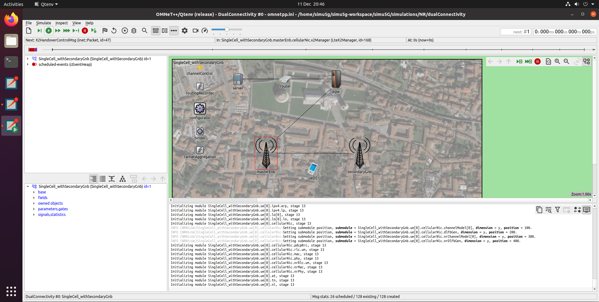 

Quando estiver satisfeito, para encerrar a simulação, basta clicar no ícone "Conclude simulation" localizado na barra de tarefas. Isso te levará de volta à tela anterior e você poderá fechar a máquina virtual com segurança.

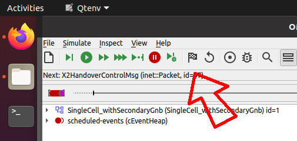
